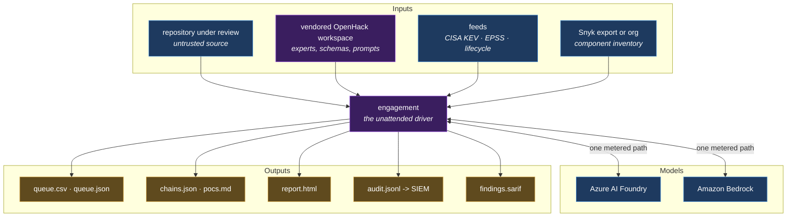
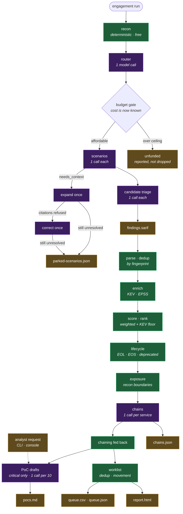
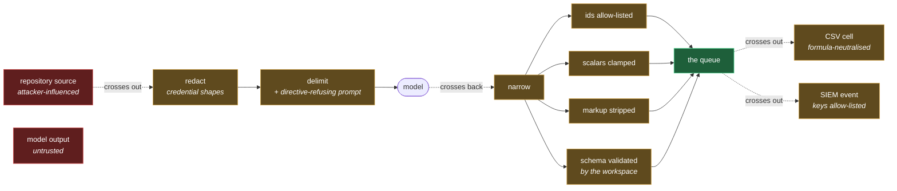
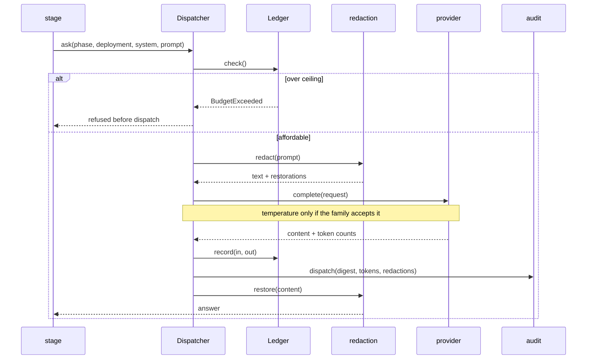
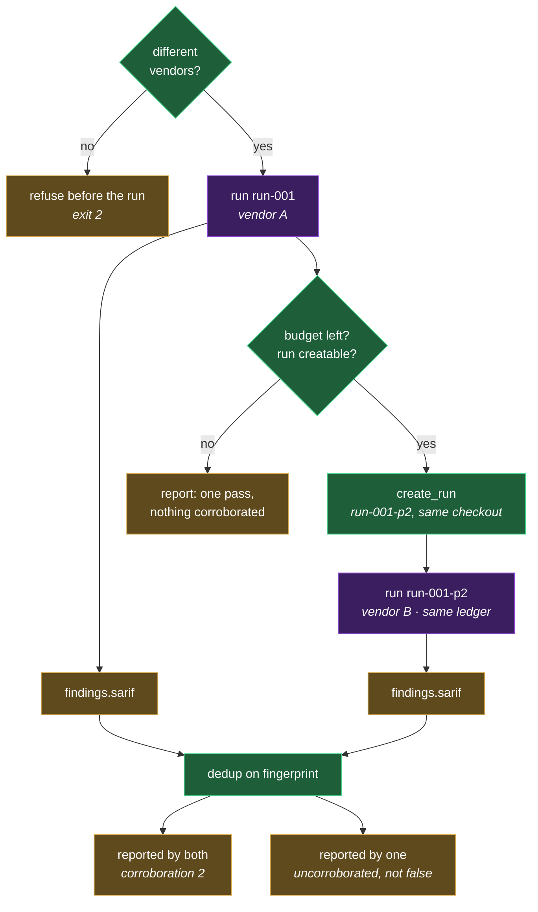

# Data flow

What moves through this system, in what shape, and what happens to each thing
when its input is missing.

[docs/DESIGN.md](DESIGN.md) explains *why* the design is what it is. This
document is the map: the stages, the contracts between them, the trust
boundaries, every artifact written, and — the part worth reading if you read
only one section — the [degradation matrix](#degradation-what-happens-when-an-input-is-missing),
which says what a run still means when a feed, a credential or a budget is
absent.

---

## 1. System context

Three things this package talks to, and one it deliberately does not.



**Not in this picture:** `codescan-mcp`. It shares lineage but is not a
dependency — nothing here imports it. And since the backbone was ported,
`codescan-triage` is not a dependency either; the only external code that ships
with this package is the vendored OpenHack workspace.

Both absences are held in place by a frozen artifact rather than by an import
that might not resolve: `vendor/openhack/vendor-manifest.json` for the
workspace, `tests/data/backbone_vectors.json` for the backbone. Neither can be
skipped by an environment that lacks the thing it checks against, which is the
whole point — the backbone's previous check *was* skippable that way and so
never ran anywhere.

`codescan-mcp`'s absence is stronger than "not imported": its fingerprints are
a different scheme (32 chars over `(vuln, locus, repo)`, CWEs collapsed to
their family) and no input agrees with this one's (64 chars over a
`dep|`/`code|`-discriminated key). Findings are not correlatable across the
two estates, and no code on either side notices the attempt.

---

## 2. The pipeline, end to end

Two halves that fail independently. The **driver** proves vulnerabilities; the
**queue** decides which matter. A failure in the second never destroys the
first, because the first has already written its SARIF and its audit trail.



Note where the colours change. Everything green is deterministic and free —
**the queue is produced without a model**. The purple stages annotate it. That
ordering is what makes the advisory layer safe to run unattended: the worst
outcome of a bad model answer is a missing appendix, not a missing finding.

---

## 3. Stage contracts

Each stage's input and output type, and whether it can spend money.

| Stage | Module | In | Out | Spends |
|---|---|---|---|:--:|
| recon | `workspace` | repo checkout | routing units | — |
| router | `driver` | recon inventory | backlog of `ScenarioRef` | ● |
| scenarios | `driver` | `RenderedPrompt` | `ScenarioOutcome` | ● |
| expansion | `expansion` | `missing_context[]` | supplied files, refusals | ● |
| correction | `expansion` | the recorder's integrity complaint | a re-answered scenario | ● |
| triage | `driver` | candidate | decision | ● |
| export | `workspace` | recorded findings | `findings.sarif` | — |
| parse | `backbone` | SARIF | `Finding[]` + `IngestError[]` | — |
| dedup | `backbone` | `Finding[]` | `Finding[]` merged on fingerprint | — |
| enrich | `backbone` | `Finding[]`, KEV, EPSS | `Finding[]` + `kev`/`epss` | — |
| score | `backbone` | `Finding` | `Finding` + `ScoreBreakdown` | — |
| project | `triage` | `Finding` | `ScoredFinding` | — |
| lifecycle | `lifecycle` | `ScoredFinding[]`, inventory | + minted findings, adjustments | — |
| exposure | `signals` | recon boundaries | `exposure` + adjustment | — |
| chains | `analysis` | `ScoredFinding[]` | `Chain[]` | ● |
| chaining | `signals` | `Chain[]` | `chaining` + adjustment | — |
| PoC | `analysis` | critical `ScoredFinding[]` | `Poc[]` | ● |
| PoC on request | `analysis` | named ids, any score | `Poc[]` | ● |
| worklist | `export` | `ScoredFinding[]`, baseline | `Row[]` → CSV | — |

**All four score dimensions are now populated.** Severity and exploitability
come from the backbone; `exposure` from recon's request boundaries (a route
registration, webhook handler or SAML callback makes a file externally
reachable — a fact recon already established and the scorer was throwing away);
`chaining` from the chain-discovery stage, which was producing exactly the
signal the dimension was named for and had nowhere to put it.

Both arrive as **recorded, reversible adjustments**, in the same shape as the
lifecycle bump. `ScoredFinding.base_score` subtracts every one of them, so the
backbone's own number is always recoverable — an adjustment you cannot undo is
an assertion, not an explanation.

**Why two Finding types.** `backbone.Finding` carries scoring machinery —
breakdowns, adjustments, raw detection counts. `contracts.ScoredFinding` is the
narrowed projection every later stage reads. Narrowing at one point
(`triage.project`) keeps the scorer's internals out of five other modules and
means an estate that swaps the scorer changes one adapter.

**Why two dedups.** `backbone.dedup` merges *scanner claims* on fingerprint
before scoring — two tools reporting one weakness become one finding with
`corroboration=2`. `export.dedupe` merges *rows* after scoring and computes the
worklist's provenance columns. Different layers, different keys, both needed
once more than one scanner feeds the queue.

---

## 4. Trust boundaries

Everything crossing a dashed line is untrusted and is narrowed on the way in.



Four rules hold at these boundaries:

1. **Credentials never reach a provider.** Redacted before dispatch, restored in
   the answer — reversible, because a model that could only see a redacted line
   could never cite one, and the findings lost would be exactly the
   hardcoded-credential ones.
2. **A model annotates, never extends.** Every id it returns is allow-listed
   against the ids it was given. A chain left with fewer than two admissible
   findings is dropped as fabricated rather than repaired.
3. **Model prose is data.** Angle brackets stripped, text truncated, scalars
   clamped — before anything reaches a rendered document.
4. **Narrowing at exit, never widening.** The SIEM exporter is a pure function
   of the audit trail with detail keys allow-listed per event kind; an
   unclassified event ships its identity and none of its payload.

---

## 5. Where the money goes

One metered path. Every stage that spends goes through `Dispatcher`, which
spends from one `Ledger`.



`engagement plan` projects this before a run starts: calls per task from the
backlog shape, dollars from the published per-token rates, and a warning when a
deployment sits below (or wastefully above) its task's tier. A deployment with
no published rate is reported **unpriced** rather than assigned a guessed rate.

Which model each of those stages actually reaches — the default allocation, the
recommended one, and the per-family quirks of the request itself — is
[docs/MODELS.md](MODELS.md).

---

## 6. Artifacts

Everything written, and who reads it.

| File | Written by | Read by | Survives the run? |
|---|---|---|---|
| `findings.sarif` | workspace export | the queue half; CI | ● |
| `parked-scenarios.json` | driver | `--resume-parked` | ● |
| `audit.jsonl` | dispatcher, every call | `export-siem`; compliance | ● |
| `queue.csv` | `export` | analysts, ticketing | ● |
| `queue.json` | `export` | machines; the next run's diff | ● |
| `<baseline>.json` | `export` | the **next** run's movement column | ● |
| `chains.json` | `analysis` | analysts; the report | ● |
| `pocs.md` | `analysis` | responders | ● |
| `pocs-requested.md` | `draft-poc` | the analyst who asked | ● |
| `decisions.jsonl` | the control plane | the console; the next run's queue | ● |
| `threat-model.md` | `threatmodel` | whoever decides what to fix | ● |
| `report.html` | `report` | analysts; ticket attachments | ● |
| `kev.json` | `fetch-kev` | enrichment | cached |

The baseline is the only artifact whose *purpose* is the next run: it carries
each finding's previous severity, previous score, and the run it was first seen
in, which is what makes `severity_delta` and `first_seen_run` possible.

---

## 7. Degradation: what happens when an input is missing

The most important table here. Every row is a real configuration, and none of
them fail loudly enough to notice on their own — which is why each one produces
a warning that names what the result does **not** mean.

| Missing | What still works | What the run reports |
|---|---|---|
| KEV / EPSS feeds | everything; scores fall back to the severity proxy | "an unexploited finding and an unchecked one rank the same, which is not the same claim" |
| **stale** KEV | everything | the catalogue's age, and that CVEs added since score as un-exploited |
| lifecycle feed | everything except the lifecycle check | "no component was checked… this is not a finding of *none*" |
| component inventory | lifecycle on findings' own components only | "a source-only review carries no dependency inventory" |
| a component absent from the feed | everything | `unknown` — **never** `supported` |
| baseline | the whole worklist | movement reads `unknown`, never `new` |
| budget mid-run | what was reached | remaining items as `unfunded`, exit code 3 |
| model deployment | nothing that stage does | refuses to start; never guesses a deployment |
| a configured deployment the resource does not serve | nothing — the run is refused before dispatch | the missing name, the task that wanted it, and the deployments in that family that exist. **Never a substitution** |
| the provider cannot list its deployments | everything; the run proceeds | *unchecked*, warned, and exit 3 from the standalone command — a listing that failed is not a check that passed |
| two providers configured | nothing | refuses; never guesses a bill |
| a chain call fails | every other service | those findings named as *never examined* |
| a PoC batch fails | every other batch | those findings named as *not attempted* — never *implausible* |
| a finding is below critical | the whole queue; it ranks normally | named as undrafted, with the request path — a draft is asked for by id, not argued past a threshold |
| a cache prefix below the model's floor | the whole prompt; the text is sent inline | counted, because the API would accept the breakpoint and cache nothing |
| a cache offered and never read | everything | a warning: every call paid the write premium for an entry nothing reused |
| no run directory for the console | the machine API | the console is not mounted at all, rather than rendering an empty queue as though the run found nothing |
| recon boundaries (exposure) | drafting still runs | every finding at the no-boundary baseline, so fewer reach critical — the missing recon is reported |

The single rule underneath all of it: **absence is reported as absence.** A
stage that could not check something must never produce output shaped like a
stage that checked and found nothing.

---

## 8. Two detection passes

A second pass is only worth paying for if it can *disagree* with the first.
Two models from one vendor share training data, tokenizer lineage and refusal
behaviour, so they miss the same things in the same places — and a second pass
that agrees for structural reasons produces a corroboration count that reads
like evidence and is not. **Same-vendor pairs are refused, not warned about.**

The driver orchestrates both. `--second-model` is the whole interface.



```bash
engagement run acme run-001 --workspace ./workspace \
  --expert-model claude-opus-5 --second-model gpt-5.6-luna --triage
```

**Why a separate run rather than a second sweep.** The workspace treats a
scenario as finished once a result is recorded, so both passes writing into one
run would yield a single SARIF with no way to attribute findings to a pass —
losing exactly the signal the second pass exists to produce. Separate runs also
give each pass its own checkout, agent ids and context by construction, and the
sibling run is created from the first run's own `run-config.yaml` so both
passes review the *same* commit. Agent-id uniqueness is enforced across passes,
not just within one.

Both passes spend from one ledger. Every way the second pass can fail to happen
— budget exhausted, run not creatable, pass errored, no SARIF produced, second
pass incomplete — appends a warning naming what the queue therefore does not
mean.

Consolidation is `backbone.dedup`, which already merged on fingerprint and set
`corroboration = len(scanners)` — the two passes simply give it something real
to count. **A finding only one pass saw is kept**, and the summary says so
explicitly: uncorroborated is not false, only uncorroborated. Dropping it would
be suppression dressed up as precision.

`ENGAGEMENT_ALLOW_SINGLE_VENDOR=1` downgrades the refusal to a loud warning, for
an estate with only one vendor available. It has to be a deliberate choice.

## 9. Honest limits

**Only one of the two surfaces writes.** `report.html` is read-only by design and
stays that way — it is an artifact you attach to a ticket and open with no
server. The console is its counterpart and the sole write path: deciding needs
an authenticated principal, so it signs in over OIDC authorization code with
PKCE and holds the token in a JavaScript variable, sent as a bearer and never as
a cookie. A page that let an anonymous reader close a finding would undo the
invariant the estate is built on, which is why these are two surfaces rather
than one page with a login button.

**Not verified live:** the Bedrock request shapes are asserted offline but never
called; `PostgresClaimStore` is unproven against a real database; the JWKS
network hop is stubbed in the suite. See the end of [DESIGN.md](DESIGN.md).
