# Design

Architecture and rationale for `codescan-engagement` — the unattended driver
that turns scenario-first whitebox review into a scheduled, budgeted, portable
service.

For deployment topology see [DEPLOYMENT.md](DEPLOYMENT.md).

## What this is, and what it deliberately is not

`codescan-engagement` drives an **OpenHack workspace** to completion with no
human in the loop, spending a bounded budget and reporting honestly on what it
did not reach.

It is **not** a reimplementation of that workspace. The methodology — recon,
routing units, scenarios, proof obligations, independent finding triage — stays
where it is, and so, crucially, do its integrity checks. This package supplies
the three things an attended workflow got from the person sitting in front of
it: a driver, a budget, and a disposition for work that could not be concluded.

That boundary is the whole design. Everything below follows from it.

## Why an unattended run is defensible at all

The obvious objection to removing human gates is that the gates were what made
the output trustworthy. Reading the workspace closely, that turns out not to be
true — the *approvals* were human, but the *checks* are code, and they run
whether or not anyone is watching:

| Check | Enforced by | What it stops |
|---|---|---|
| Coverage validation | `record-scenario-backlog` | A router silently skipping a mandatory routing unit |
| Evidence grounding | `record-scenario-result` | A cited source line that does not exist in the checkout |
| Prompt-hash binding | both recorders | A result recorded against a prompt never rendered |
| Agent-id uniqueness | both recorders | One context masquerading as many independent reviews |

The last one is the load-bearing surprise: because the workspace rejects a
repeated `subagent_id`, a driver that loops an entire backlog through a single
model conversation is **refused**. The per-scenario isolation the methodology
depends on is enforced against the automation, not merely requested of it.

So what the human gates actually contributed was scope selection, spend
authorization, and judgement on ambiguity. Three of those are policy. The
fourth is the reason `parked` exists.

## Authority: who decides what

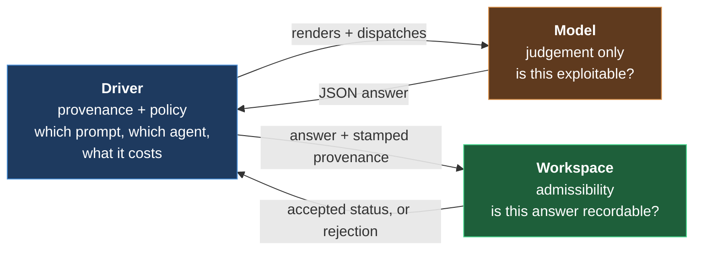

Three rules, and the tests are named after them:

1. **The driver stamps provenance.** The prompt digest and the agent id are
   facts about the dispatch. A model asked to report them is reporting a claim,
   so the driver overwrites whatever the model supplied with what it observed.
2. **The model supplies judgement only.** Verified or rejected, severity,
   rationale, evidence.
3. **The workspace decides admissibility.** The driver never relaxes a
   recorder's check, and treats a rejection as a disposition rather than an
   error to route around.

## The run, end to end

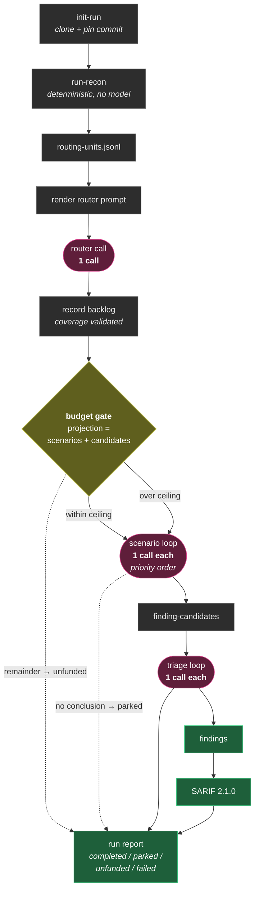

Deterministic phases are free; only three phases spend. That is why the budget
governor only ever gates those three.

## The budget gate, and why it sits exactly there

OpenHack's cost model is unusually well behaved:

```
cost = 1 router call
     + 1 call per scenario
     + 1 call per candidate
```

Unlike a detection sweep — where cost is `batches × models × passes` and only
knowable once you are inside it — **the expensive phase is countable before you
enter it.** The backlog is recorded and validated, then the scenario loop
begins. That gap is precisely where the human gate stood, and it is where the
policy stands now, with the same information the human had.

When the projection exceeds the ceiling, the run does not abort and does not
silently truncate. It sorts the backlog by the scenario's own `priority` field,
spends what it has on the top of that list, and records every scenario it never
dispatched as `unfunded`:

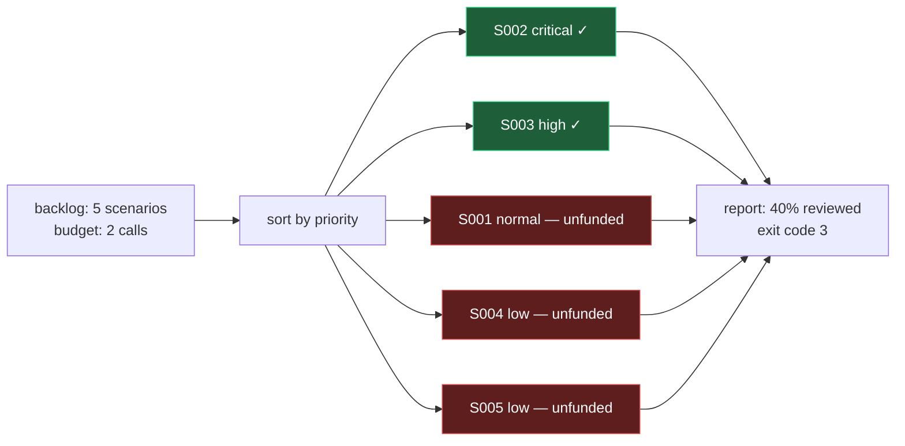

## Dispositions: the one thing that must never be silent

Every unit of work ends in exactly one of four states, and three of them mean
"not done":

| Disposition | Meaning | Counted as clean? |
|---|---|---|
| `completed` | The model reached a conclusion the workspace accepted | Yes |
| `parked` | The model concluded it lacked context | **No** |
| `unfunded` | Budget ran out before dispatch | **No** |
| `failed` | The answer was rejected after retries | **No** |

`parked` deserves the emphasis. A scenario that ends `needs_context` is not
retried, because re-dispatching an unchanged prompt spends budget without
supplying the missing context — it is a *result*, not a transient failure. It
is reported, and it keeps the run out of a clean exit code.

This is the same discipline the rest of the estate calls "every bound is a
suppression surface." A finding count without a denominator beside it is not a
result, so `RunReport` exposes `reviewed_fraction` and refuses to let a
half-reviewed backlog look like a quiet one.

Exit codes carry it to the scheduler: **0** everything concluded, **3** the run
finished with work parked or unfunded, **2** configuration refused, **1**
failed. Three is deliberately not zero.

## Parked scenarios: the second attempt worth paying for

Parked work survives the run that produced it. `--resume-parked` reads
`parked-scenarios.json` and re-attempts each entry, because the workspace
considers a parked scenario *finished* — it recorded an inconclusive result —
so it never returns to the pending list. The durable queue is the only route
back to that work, which is the whole reason it is written to disk. Each
re-attempt gets a fresh agent id, so it is an independent review rather than a
continuation of the one that gave up.


A scenario that ends `needs_context` is the model stating, in its own words,
what it lacked — the workspace already requires that statement to be concrete
rather than a shrug. That statement is the only thing that makes a second
attempt worth its call.

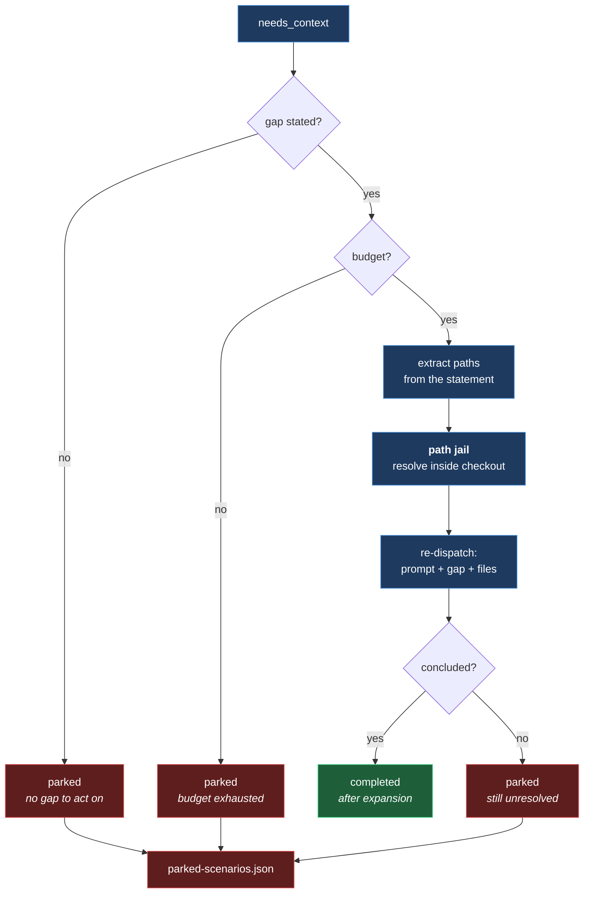

Three things about this are load-bearing:

**The paths come from model output, so reading them is a jail, not a
convenience.** `read_source` resolves each requested path against the checkout
and refuses anything that escapes it, so hostile text inside a scenario prompt
cannot steer an expansion into `/etc/passwd` or a sibling repository. A refusal
returns nothing and is *reported*, never raised.

**Every refusal is a bound, so every refusal is named.** Paths that did not
resolve, files truncated to fit, and the per-expansion file cap all land in the
parked record — and in the prompt itself, so a second inconclusive answer is not
caused by an omission the model was never told about.

**The queue is written to disk.** `parked-scenarios.json` sits beside the run,
carrying the reason, the model's stated gap, what was supplied, and what could
not be. Unreviewed work that exists only in a process's stdout is
indistinguishable from work that was never attempted, once that process exits.

Because the expanded attempt sees more than the rendered prompt, the result
records `context_expansion_sha256` alongside the prompt digest. Provenance that
names only part of the input is not provenance.

## Retry policy

Only one class of outcome is retried:

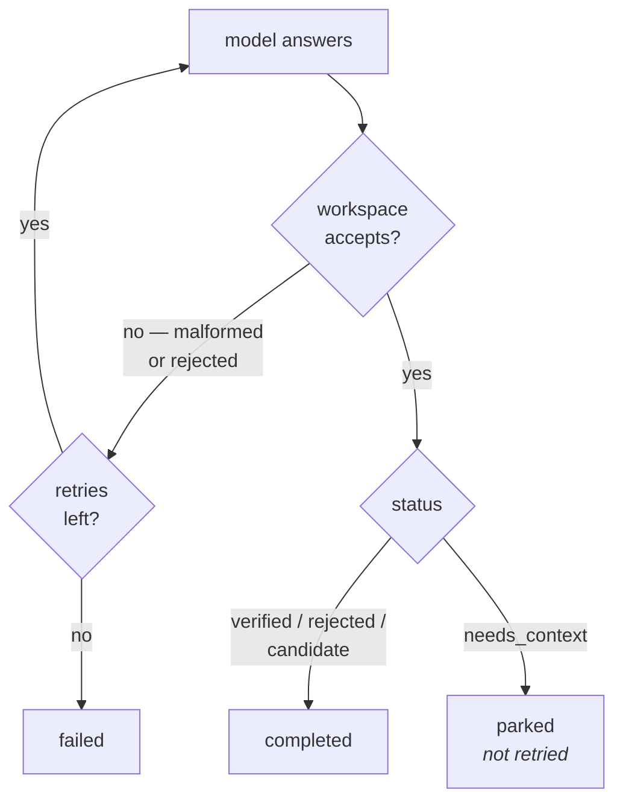

A rejected answer may be a transient formatting failure and is worth one more
attempt. A conclusion of "I need more context" is the model's considered
judgement, and spending again on the identical prompt would be superstition.

## The other half: triage

An engagement proves vulnerabilities. It does not decide which of them matters
most across an estate — that needs exploit intelligence, an explainable score,
and a rank that survives comparison with findings from every other source.

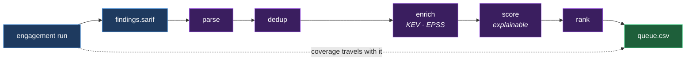

`triage.py` is a port onto the codescan backbone, the same shape as the
workspace port: a protocol, a lazily-imported adapter, and a gate that runs
without it. It is not a second implementation of scoring.

Two properties survive the handoff deliberately. **A missing feed is reported,
not silently zeroed** — scoring without KEV/EPSS is a legitimate documented
fallback to the severity proxy, but a queue scored that way must say so, because
"nothing is exploited" and "we did not look" rank identically and mean opposite
things. And **the run's coverage travels with the queue**: a ranked list built
from a 40% backlog is announced as ranking what was reviewed, not what exists.

The adapter parses the SARIF file directly rather than sweeping a directory,
because the directory sweep matches `*.json` only — a `.sarif` file would be
passed over in silence, which is the one outcome this pipeline must never
produce.

## The blind spot: components nobody is maintaining

Everything above this line keys on a *known vulnerability*. A scanner reports
what has been published against a component and the queue ranks it. Follow that
faithfully and a component with no CVE produces no finding — including the
component that has no CVE because nobody is left to file one.

That is the wrong kind of quiet. An unmaintained dependency is the single
exposure class that cannot be remediated by patching, because the patch is never
coming. So lifecycle is modelled as a condition in its own right rather than as
a modifier on something else:

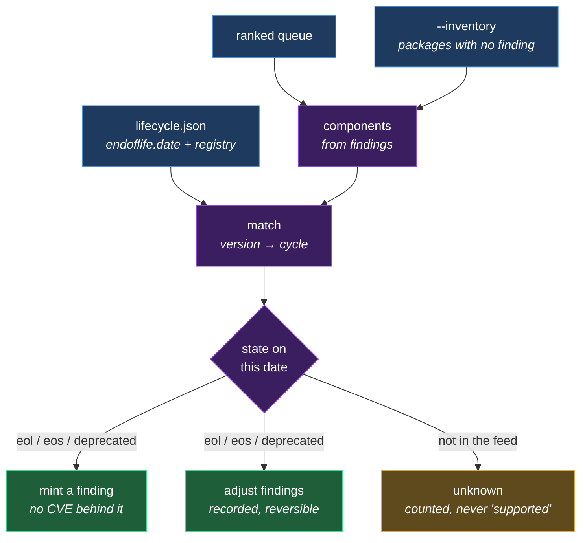

Three states, kept distinct because they carry different obligations.
`deprecated` is a maintainer's statement that something supersedes this, and
fixes may still arrive. `eos` is *contractual* — standard support ended, and a
fix may still be purchasable. `eol` is technical and final: no further updates
of any kind. Collapsing them loses the difference between "plan the upgrade" and
"you are on your own", which is the difference an owner is being asked to fund.

The pass is deterministic and offline — a date comparison, never a model call.
Lifecycle is a fact about a published release calendar, and a question with a
checkable answer should never be handed to something that guesses. It is the
same reasoning that keeps KEV and EPSS on feeds rather than in a prompt.

Two design decisions are worth naming. The adjustment is **recorded beside** the
backbone's score rather than folded into it, so `base_score` always recovers the
original — an adjustment that cannot be undone is an assertion, not an
explanation. And `unknown` **outranks** `supported` in the state ordering: an
uncovered component is an open question, and an open question must never sort
below a settled good answer.

## The advisory layer: chains and PoC drafts

A ranked queue answers "which finding first?". It does not answer what a
responder asks next, and neither follow-up falls out of per-finding scoring:
chaining is cross-finding, and a reproduction is procedural.

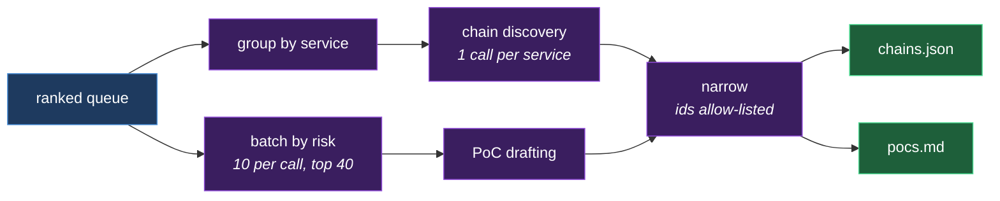

Both stages are **advisory and subordinate**: they annotate a queue that is
already complete and ranked. That ordering is what makes them safe to run
unattended, because the worst outcome of a bad model answer is a missing
appendix rather than a missing vulnerability. A chain call that fails costs its
service's chains; a PoC batch that fails costs its own drafts.

The caps are not tuning. A PoC per finding makes the *output* grow with the
finding count, and a large queue overruns the output limit and truncates
mid-JSON — losing every draft in the response rather than the last one. Batching
bounds the output by bounding the input. Because a cap can drop something, every
capped, unaffordable and unanswered finding is named in the summary and in the
pack: **no PoC means not attempted, never implausible.**

Chains are scoped per service because a chain between components that never talk
is not a chain, and the fingerprint hashes the *finding set* rather than the
generated id — so an analyst's decision about a chain survives a rescan that
renumbers everything.

Both stages meter through the run's own dispatcher, which exists precisely so
they cannot spend into a second, empty ledger while both tallies look healthy.

## Getting the trail into a SIEM

The audit file answers "what did the 02:00 job do" for whoever is holding it. A
SIEM is where that question actually gets asked — beside every other system's
trail, by people who will never open a run folder.

`siem.py` renders the trail as ECS (JSON lines, native to Elastic and mappable
by Splunk, Sentinel, Chronicle and OpenSearch) or CEF (ArcSight, QRadar, syslog
collectors), or passes JSONL through unchanged.

The governing rule is **narrowing, never widening**. The trail is already safe
to ship: prompt *digests*, token counts and redaction *counts*, never prompt
text, model output or a redacted value. An exporter that enriched on the way out
— reading the run folder, attaching the source a finding came from — would break
that guarantee at exactly the boundary where the data leaves, and into a system
with broad read access and long retention.

So the exporter is a pure function of the audit file, and detail keys are
allow-listed per event kind on top. An event kind nobody has classified ships
its identity and **none** of its payload: failing closed is the only safe
default at a trust boundary, and it means a future stage that starts recording
something sensitive fails the allow-list instead of quietly shipping it.

One signal is added rather than passed through, and it is derived from the event
itself: a run that finished incomplete is exported at a raised severity. The
fact was already in the event; the exporter only makes it legible to a rule that
ranks on severity, so the runs that mattered are findable without parsing prose.

## Identity: giving "human" a referent

The estate's oldest invariant is that a machine proposal never overwrites a
human decision and never sets a terminal state. That rule is only as strong as
the word *human* in it — and until now "human" was an unauthenticated actor
string that anything able to write to the store could claim.

`identity.py` gives it a referent. Three roles fall out of the invariants
rather than being invented for symmetry:

| Role | May | Rationale |
|---|---|---|
| `scanner` | Run scans, spend budget | What an unattended run acts as, and nothing more |
| `analyst` | Set non-terminal states | Investigate |
| `approver` | Set terminal states | Closing a finding ends review |

Separating the last two is the point: a terminal state asserts that nobody
needs to look again, and letting whoever triages also close is how a queue
quietly empties itself.

Two details are load-bearing. `authorize()` **raises rather than returning a
flag**, because a caller who forgets to check a boolean fails open and this is
the one decision where failing open means anonymous closure. And machine
identity is derived from the **subject**, not the role set — a role can be
granted by mistake, while the subject is minted by whatever issued the
credential, so an `admin` role on a `machine:` subject still cannot close a
finding.

## The control plane

Identity told us what a principal *may* do. The control plane establishes who
the principal *is*, and is the half that has to be right for the other half to
mean anything: an authorization model over a subject anyone can assert is a
suggestion.

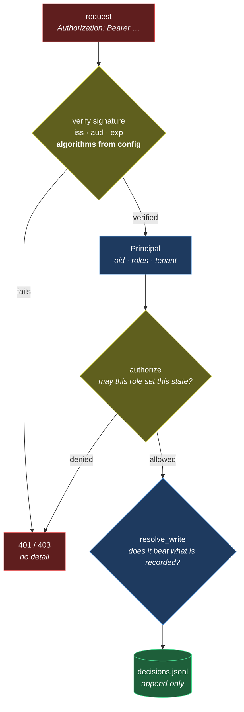

Three properties are worth stating plainly.

**Verification is delegated, not invented.** Hand-rolled JWT validation is a
well-populated graveyard — algorithm confusion, unverified `kid`, missing
audience checks, `alg: none` — and none of those are mistakes this project is
better placed to avoid than a library that exists to avoid them. The accepted
algorithms come from configuration and are passed explicitly, so the *token*
can never choose; that single line is what stops a published public key being
used as an HMAC signing secret. Both forgery families have tests that build the
attack byte by byte rather than through the library's own guardrails.

**Failures are quiet and uniform.** A missing header, a forged signature, a
token for another audience and a token from another tenant all produce the same
`401 {"error": "unauthorized"}`. The reason is logged for the operator and
withheld from the caller, because a verification oracle only ever helps the
party holding a bad token.

**Authorization runs before storage is touched.** An analyst attempting to
close a finding is refused without the decision log learning that the attempt
was made against that fingerprint, and `resolve_write` then refuses a machine
actor a second time without consulting authorization at all. The two checks are
independent on purpose: a caller that skips the first still cannot smuggle a
machine proposal past the second.

The subject is read from `oid` in preference to `sub` because Entra's `sub` is
pairwise per application — a decision record has to still name the same person
after the application is re-registered. Directory values map to roles through
explicit configuration, and anything unmapped grants nothing: inferring
authority from a group named `security-approvers` is how a rename becomes a
privilege escalation.

## Multi-host work: claims without an orchestrator

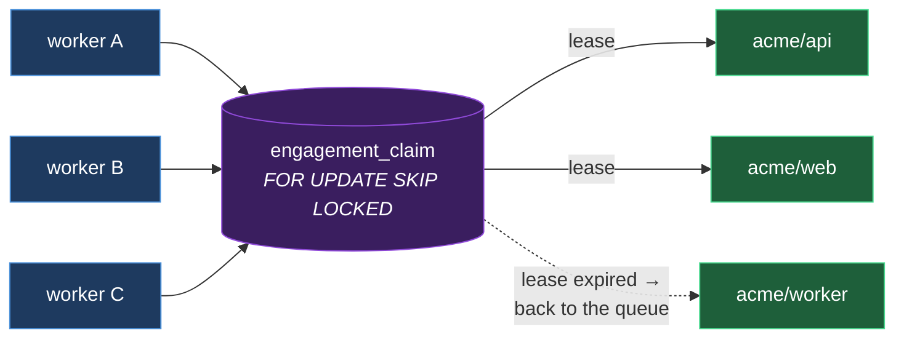

`SELECT ... FOR UPDATE SKIP LOCKED` is the entire mechanism: the row lock
serializes the claim, and skipping locked rows lets another worker step over a
held one instead of queueing behind it. No orchestrator sits above this, and
the database is the one already run for state and the index.

Three properties matter more than throughput, and each has a test named after
it: two workers never hold the same repo, an expired lease returns the repo to
the queue so a dead worker strands nothing, and a repo that fails every attempt
is marked `failed` rather than leased forever.

## Portability

Cloud neutrality is a property of exactly one module. `providers.py` holds the
`ModelProvider` protocol and its implementations; the driver, the budget
governor, and the workspace adapter never learn which cloud they are on.

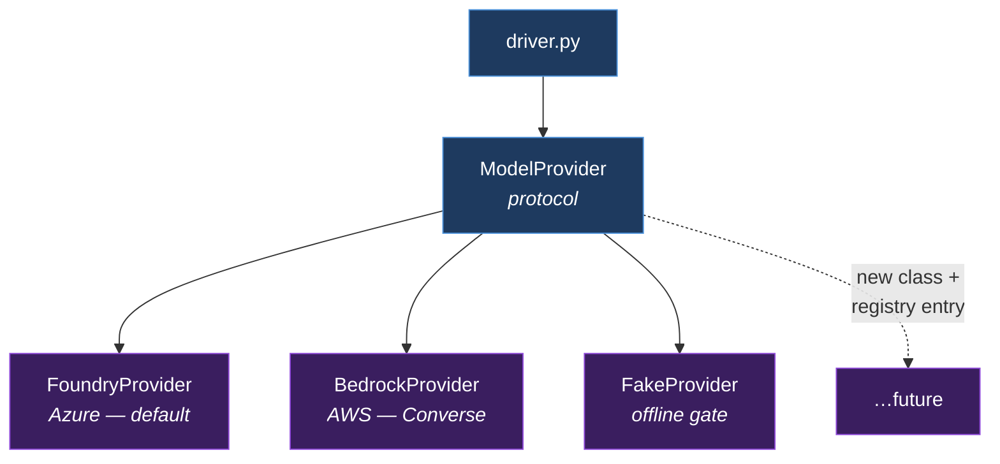

Each client library is imported lazily inside `complete()`, so the base package
installs with neither `httpx` nor `boto3`, and a test run cannot accidentally
reach the network. Every provider exposes `build_request()` as a pure function
returning the exact call it would make — which is how the part that genuinely
differs per cloud, the request shape, is asserted offline in the gate.

Two provider details worth keeping:

- **Foundry** splits by family: `claude-*` deployments answer only on the
  Anthropic-native surface, everything else on the OpenAI-compatible one, and
  `gpt-5`/`o3`/`o4` need `max_completion_tokens` rather than `max_tokens`. The
  API key travels in a header, never the URL.
- **Bedrock** targets the Converse API rather than the Anthropic-native
  surface, because Converse reaches Anthropic, Meta, Mistral, Amazon and Cohere
  through one request shape. Cross-region inference profiles (`us.`, `eu.`,
  `apac.`) are part of the model id, applied at most once. Families with no
  system channel get the system prompt folded into the user turn rather than
  dropped — discarding it would take the directive-refusing instruction with
  it. No credential is held: botocore signs with SigV4 at dispatch.

**Two configured providers is a refusal, not a default.** An unattended run has
nobody to notice it picked the wrong model set, or the wrong bill.

## The workspace port

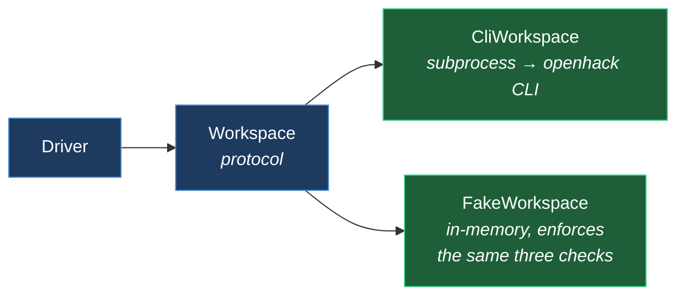

`CliWorkspace` shells out because the CLI *is* the documented contract — the
recorders it invokes are the same ones a human would run, so the driver cannot
acquire privileges a human did not have.

The fake in the gate deliberately enforces prompt-digest matching, agent-id
uniqueness, and scenario existence. A permissive fake would let the suite pass
while the driver quietly violated the methodology, which is the one failure a
test suite must not be able to miss.

## Data flow and where state lives

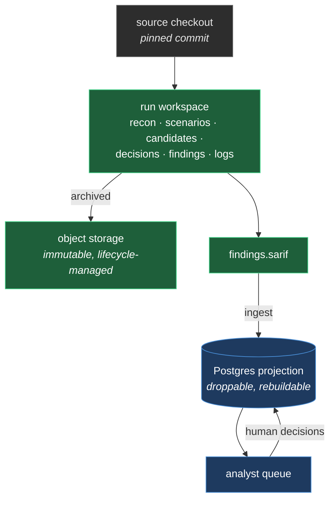

Two tiers, and the direction of authority between them matters:

- **Files are the record of truth.** The run workspace is append-only in
  practice and fully resumable; every phase is derived from what is on disk.
  Archive it to object storage with an immutability policy.
- **Postgres is a projection.** Dropping and rebuilding it is routine, never an
  incident. It exists for the two questions files cannot answer without a full
  sweep — queries *across* repositories and *over* time.

The one asymmetry to respect: artifacts get pruned, and projection rows are
what remain of older runs. A rebuild can only reconstruct what is still on
disk, so rows must not be casually deleted.

**This is why the store is relational rather than document-oriented.** The
dominant queries are joins and aggregates across repo × time × severity × CWE ×
state, and the most valuable query in the system — grading machine belief
against human judgement — is a join between findings and analyst decisions.
`JSONB` with GIN indexes covers the genuinely variable parts (score breakdowns,
raw findings, coverage) without giving up joins, and transactional leases give
horizontal scale with no orchestrator. The non-relational tier that *is* wanted
is object storage for artifacts, not a second semi-structured copy of the data.

## Resumability, and why it suits batch work

Nothing about run progress lives in this process. `Driver.run()` asks the
workspace for the current phase on **every** iteration and dispatches from
that, so a run that is interrupted — a spot instance reclaimed, a container
evicted, a budget exhausted — resumes from disk with no reconstruction.

That makes the file-based state machine an asset for unattended operation
rather than a quirk of its attended origins: crash-safety comes free, and the
same run can be picked up by a different worker on a different host.

## What this does not do yet

- **No multi-host work claims.** One driver, one run. Distribution across a
  repo list belongs in the platform's lease table, not here.
- **The analyst view is still read-only.** The control plane can accept a state
  change over HTTP, but the generated HTML does not call it — it renders a run
  and links nothing. Wiring the two together is a small piece of work and a
  deliberate next decision rather than an oversight.
- **`PostgresClaimStore` is untested against a live database.** The SQL mirrors
  the platform's proven claim table, and the properties are covered against the
  in-memory store, but no integration test runs the real thing.
- **JWKS fetching is untested against a live issuer.** Verification is proven
  against real RSA keys and real forgeries, but the network hop that retrieves
  Entra's published keys is stubbed in the suite.
- **No rate limiting on the control plane.** A valid token can call it as fast
  as it likes; that belongs at the ingress, and is not implemented here.
- **No control-plane authentication.** This is a batch job with no listening
  surface, which makes the gap inapplicable rather than ignored — but it
  becomes load-bearing the moment a UI or API is put in front of it.
