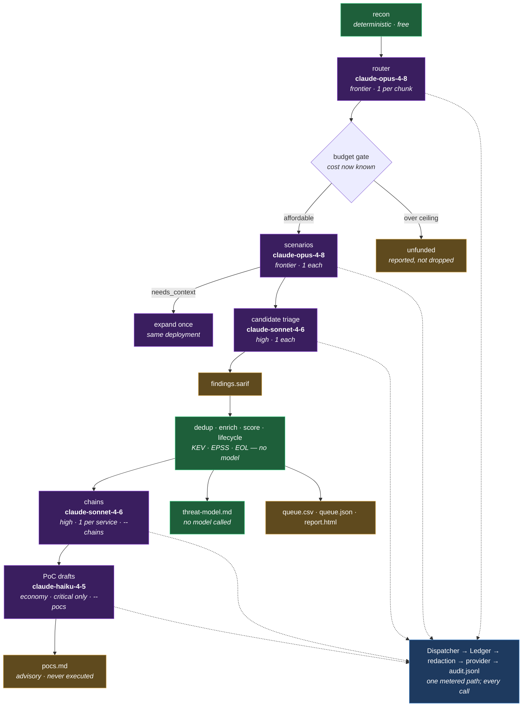
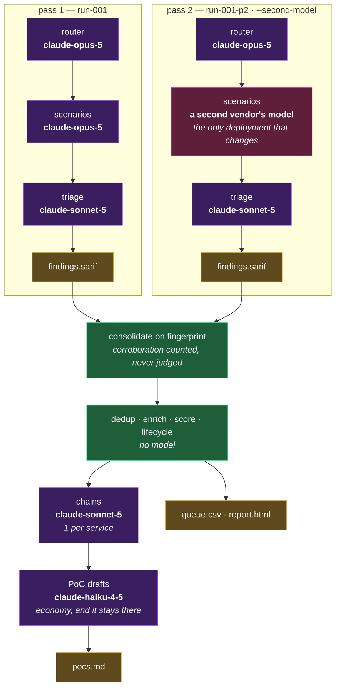
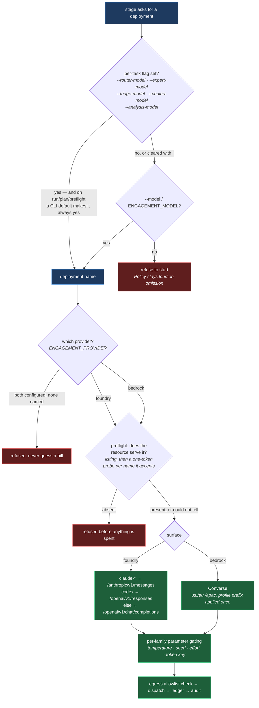

# AI models: what is called, where, and with what

This package is an **LLM application over hosted models**. Nothing here is
trained or fine-tuned; every model is a deployment on somebody else's resource,
reached through one provider interface, and every call it makes is metered,
audited and bounded before it happens.

This document is the register of that usage: every place a model is called,
which model is called there by default, what is recommended instead for a real
engagement, and — the part that is easy to lose — every place a model is
deliberately **not** called.

[docs/DESIGN.md](DESIGN.md) explains why the pipeline is shaped this way;
[docs/DATAFLOW.md](DATAFLOW.md) maps the stages and artifacts. This one answers
"what is the AI, and where".

---

## 1. The short answer

Five tasks spend money. Everything else in the pipeline is deterministic.

| Task | Default deployment | Tier | Calls |
|---|---|---|---|
| `router` | `claude-opus-4-8` | frontier | 1 per chunk of the backlog |
| `scenarios` | `claude-opus-4-8` | frontier | 1 per scenario — the bulk of the run |
| `triage` | `claude-sonnet-4-6` | high | 1 per candidate |
| `chains` | `claude-sonnet-4-6` | high | 1 per service (opt-in, `--chains`) |
| `poc` | `claude-haiku-4-5` | economy | 1 per 10 critical findings, cap 40 (opt-in, `--pocs`) |

The allocation follows one rule — **spend on judgement, economise on volume** —
and the defaults live in [`cli.py`](../src/engagement/cli.py) as
`DEFAULT_ROUTER_MODEL` and friends, so a plain `engagement run` needs no
deployment named at all.

The provider underneath is **Microsoft Azure AI Foundry** by default, with
**Amazon Bedrock** as the alternative. Which one is used is configuration, not
a fallback: two configured providers with no `ENGAGEMENT_PROVIDER` set is a
refusal, because an unattended run should never pick a bill on its own.

---

## 2. Every place a model is called

Every dispatch site in the package. All of them go through `Dispatcher.ask`, and
therefore through one `Ledger`, one redaction pass and one audit record.

| Site | Module | What the model is asked for | What the answer is allowed to do |
|---|---|---|---|
| router | [`driver.py`](../src/engagement/driver.py) | Turn the recon inventory into a backlog of scenarios and coverage decisions | Proposes work. The workspace validates coverage obligations; ids are renumbered on merge |
| scenarios | [`driver.py`](../src/engagement/driver.py) | Review a routing unit against one scenario and state a result with quoted evidence | Proposes a finding. Every citation is re-validated against the checkout |
| context expansion | [`expansion.py`](../src/engagement/expansion.py) | Re-attempt one scenario that ended `needs_context`, given the context it said it lacked | Same as a scenario. Fires once, only when the model named a gap |
| triage | [`driver.py`](../src/engagement/driver.py) | Adjudicate a candidate finding against evidence already gathered | Proposes a verdict. The workspace re-validates the citations regardless |
| chains | [`analysis.py`](../src/engagement/analysis.py) | Combine findings across a service into an attack chain | **Advisory only.** Annotates a queue that already exists |
| PoC drafts | [`analysis.py`](../src/engagement/analysis.py) | Draft a reproduction procedure for a finding already established | **Advisory only.** Never executed; a human reads it first |

Context expansion is not a separate task in the cost table — it re-dispatches
the *scenarios* deployment — but it is a real call, and it is the one place a
model's own words about what it lacked are fed back into a prompt.

### Where a model is deliberately not called

Half the value of a register like this is the other half. These stages are free,
offline and repeatable, and each one is deterministic **on purpose**:

- **Scoring and ranking** — weighted dimensions with a KEV floor. A score you
  cannot take apart is a score an analyst has to take on faith.
- **Dedup and consolidation** — fingerprint match, including across two
  detection passes. Corroboration is counted, never judged.
- **Enrichment** — CISA KEV, EPSS, and package lifecycle (deprecated / EOS /
  EOL) come from feeds. A question with a checkable answer is never handed to
  something that guesses.
- **The threat model** (`threat-model.md`) — assembled entirely from what the
  run already produced. A threat model that needed a model call would be a
  fifth thing to distrust.
- **Recon, export, worklist, report, redaction, preflight** — no dispatch
  anywhere in them.
- **The console** — serving the queue, recording decisions and launching runs
  cost nothing. Its one spending button is on-request PoC drafting, which is the
  same dispatch site as the row above and needs a deployment named before it
  appears at all.

The colour split in [DATAFLOW §2](DATAFLOW.md#2-the-pipeline-end-to-end) is the
same fact drawn: **the queue is produced without a model**, and the model stages
annotate it. The worst outcome of a bad advisory answer is a missing appendix,
not a missing finding.

---

## 3. Dataflow — the default allocation

What a plain `engagement run --chains --pocs` dispatches, and to what. Purple is
a model call; green is deterministic and free.



Every dotted line goes to the same place. There is no second route to a model
in this codebase, which is what makes "every call is budgeted, redacted and
audited" a structural claim rather than a convention.

---

## 4. Dataflow — the recommended allocation

The defaults are tuned to be cheap enough to run without thinking about it. A
real engagement — one whose findings someone will act on — changes three things:
the frontier models get the current generation, triage moves up with them, and
**the detection pass is doubled across two vendors**.



The second pass is a **complete sibling run** against the same checkout, not a
second sweep of the first — its own router, its own scenarios, its own triage,
its own SARIF. Only `expert_model` is swapped, so the independence being bought
is **in the detection stage specifically**: both passes route and adjudicate on
the same deployments. That is the right place for it, because detection is where
a model's blind spots decide what is never seen at all.

Both passes spend from **one ledger**, so `--max-calls` bounds the engagement
rather than each pass — and a full second pass is roughly a doubling, since it
re-runs the expensive phase. A second pass that could not run is reported, never
silently skipped.

### Default vs recommended, side by side

| Task | Default (ships in the CLI) | Recommended for an engagement | Why the difference |
|---|---|---|---|
| `router` | `claude-opus-4-8` | `claude-opus-5` | One call decides the whole backlog; the strongest model available is the cheapest insurance in the pipeline |
| `scenarios` | `claude-opus-4-8` | `claude-opus-5`, or `claude-fable-5` for a hard target | The stage that actually finds vulnerabilities. Economising here buys a run that finds less and costs the same to review |
| second pass | *off* | a **different vendor's** frontier model | A second pass is only worth paying for if it can disagree. Same-vendor pairs are refused, not warned about |
| `triage` | `claude-sonnet-4-6` | `claude-sonnet-5` | Bounded and checkable — the workspace re-validates every citation whatever the model says |
| `chains` | `claude-sonnet-4-6` | `claude-sonnet-5` | Hard reasoning, short prompt, one call per service: a higher tier costs almost nothing at this volume |
| `poc` | `claude-haiku-4-5` | `claude-haiku-4-5` — unchanged | Writing up a finding that is already established. The hard part already happened |
| `--effort` | `low` | `low`, raised only for a target that comes back thin | The cheapest lever on both spend and wall clock, because it shortens the answer and answer length is what both are made of |

Recommended, as a command:

```bash
engagement run acme run-001 --workspace ./workspace \
  --router-model claude-opus-5 --expert-model claude-opus-5 \
  --triage-model claude-sonnet-5 --chains-model claude-sonnet-5 \
  --analysis-model claude-haiku-4-5 \
  --second-model SECOND_VENDOR_DEPLOYMENT \
  --triage --chains --pocs
```

`SECOND_VENDOR_DEPLOYMENT` is a placeholder: any deployment whose id does not
resolve to `anthropic` (see §8). A model the catalogue does not price still
runs — `plan` reports it `unpriced` rather than guessing a rate for it.

**Economising deliberately.** If the budget will not carry that, the order to
give things up in is: the second pass first (it doubles the expensive phase),
then chains and PoC drafts (advisory), then triage down a tier. Give up the
scenarios model last — it is the only knob whose saving comes out of what the
run finds.

---

## 5. How a deployment is chosen, in order

There are three layers between "a stage wants a model" and "bytes leave the
process", and each one can refuse.

**Read the first branch carefully — it is the one that surprises people.** The
five per-task flags carry CLI defaults, so on `run`, `plan` and `preflight` they
are *always* set, and `--model` / `ENGAGEMENT_MODEL` therefore never reaches
those five tasks. `engagement run --model gpt-5-mini` runs on `claude-opus-4-8`.
To move every phase, either set each per-task flag, or clear them explicitly:

```bash
# what --model alone does NOT do
engagement plan --model gpt-5-mini            # → still claude-opus-4-8 …

# what actually moves every phase
engagement plan --model gpt-5-mini \
  --router-model "" --expert-model "" --triage-model "" \
  --chains-model "" --analysis-model ""
```

`--model` and `ENGAGEMENT_MODEL` are not dead, though: they are the *only*
source for `draft-poc` and `console`, which ship no default (see below).



The asymmetry in the middle is deliberate: the **CLI** ships an opinionated
default so a plain run works, while the library `Policy` keeps empty defaults
and refuses to start without a model named. A programmatic caller is still held
to naming one.

Two commands have **no** default model and will refuse without one — they are
analyst-initiated rather than part of a run:

| Command | Needs | What it is used for |
|---|---|---|
| `engagement draft-poc` | `--model` or `ENGAGEMENT_MODEL` | The drafting call itself. Nothing else in the command spends |
| `engagement console --allow-runs` | `--model` or `ENGAGEMENT_MODEL` | On-request PoC drafting, and it is passed to launched runs as `--model` |

Without a model, `console` still serves — the PoC button is simply off.

Note the consequence of the precedence rule above: the console passes its
deployment to a launched run as `--model`, which that run's own per-task
defaults then override. So a console-launched run **drafts** with the console's
deployment and **reviews** with the CLI defaults. Worth knowing before reading a
run's cost back.

---

## 6. Per-family request quirks

Sampling and effort are **per-family facts, not global settings**, and getting
one wrong is a 400 on the whole call rather than a degraded answer. The rules
live in [`models.py`](../src/engagement/models.py) so a family gaining or losing
support is one edit, not a change at every dispatch site.

| Parameter | Sent to | Withheld from | Failure if sent blind |
|---|---|---|---|
| `temperature` (0.0) | families that still accept it | Fable 5, Mythos, Opus 5 / 4.8 / 4.7, Sonnet 5 — they removed it | 400, whole call lost |
| `seed` | OpenAI-surface families only (`gpt-`, `o3`, `o4`) | everything else | not accepted |
| `output_config.effort` | allowlisted Claude families (Fable, Mythos, Opus 4.5+, Sonnet 4.6+) | Haiku 4.5, Sonnet 4.5 | 400, whole call lost |
| `max_completion_tokens` vs `max_tokens` | `gpt-5`, `o3`, `o4` take the former | everything else takes the latter | request rejected |
| cache breakpoint | Anthropic surface (`cache_control`), Bedrock (`cachePoint`) | chat completions / responses — the prefix is folded into the system prompt instead | silently different prompt, so it is folded rather than dropped |

Platform prefixes (`us.`, `eu.`, `apac.`, `anthropic.`) are stripped before any
family match. That was a live defect: the Bedrock path sent `temperature` to a
model that rejects it, because `us.anthropic.claude-opus-5` did not match
`claude-opus-5`.

All Foundry dispatch is **streamed**, so the timeout measures silence between
chunks rather than the length of an answer. The Bedrock path still uses
non-streaming `converse` and has not been exercised against a document-sized
answer.

---

## 7. What the projection can price

`engagement plan` costs a run before it starts, from published per-token rates
(US dollars per million tokens, as published for the Anthropic API — which is
what Foundry bills at through the Marketplace).

| Deployment | Tier | Input | Output | Notes |
|---|---|---|---|---|
| `claude-fable-5` | frontier | $10.00 | $50.00 | thinking always on; no sampling parameters |
| `claude-opus-5` | frontier | $5.00 | $25.00 | no sampling parameters |
| `claude-opus-4-8` | frontier | $5.00 | $25.00 | the CLI default for router and scenarios |
| `claude-opus-4-7` | high | $5.00 | $25.00 | |
| `claude-sonnet-5` | high | $3.00 | $15.00 | non-default sampling values rejected |
| `claude-sonnet-4-6` | high | $3.00 | $15.00 | the CLI default for triage and chains |
| `claude-haiku-4-5` | economy | $1.00 | $5.00 | accepts sampling; 200K context |

**A deployment absent from this table still runs.** The projection reports it as
`unpriced` rather than inventing a rate, because a fabricated cost estimate is
worse than none. Bedrock is partner-operated and priced separately, so a Bedrock
run projects with these rates only as an approximation.

A real projection, for a 24-scenario backlog with 48 obligations, 9 candidates,
3 services and 6 critical findings:

```
task       tier      deployment                calls    est. $
--------------------------------------------------------------
router     frontier  claude-opus-4-8               4      1.25
scenarios  frontier  claude-opus-4-8              24      2.09
triage     mid       claude-sonnet-4-6             9      0.31
chains     high      claude-sonnet-4-6             3      0.11
poc        economy   claude-haiku-4-5              1      0.01
--------------------------------------------------------------
projected                                                 3.77
```

The same backlog on the recommended allocation (`claude-opus-5` /
`claude-sonnet-5`) projects the same **$3.77** — Opus 5 and Opus 4.8 are priced
identically, so the upgrade is free at these rates. Moving scenarios to
`claude-fable-5` projects **$5.86**.

### What the numbers come from, and what they still cannot know

Each task is priced on **its own measured token shape**, not a pipeline-wide
average. The averages used to be flat — 6,000 in / 1,200 out for every stage —
which is close enough for a scenario and wrong by 7x for a router chunk. The
router re-reads the whole recon on every chunk and answers with a document:

| Task | Input | Output | Cache read | Cache write | Source |
|---|---|---|---|---|---|
| router | 1,000 | 8,800 | 65,000 | 8,900 | measured, pygoat run-001 |
| scenarios | 6,100 | 2,100 | 1,600 | 530 | measured, pygoat run-001 |
| triage | 4,000 | 1,500 | — | — | **estimated**, never measured |

Cache tokens are priced at their published ratios to fresh input — a read is a
tenth, a write is a quarter more. Ignoring them was a silent ~10% understatement,
because the router reads 65k cached tokens on every chunk.

Triage has never run to completion on a live target: the one run that reached
candidates spent its budget first. Its row is a guess, and is labelled as one in
`PROFILES` so nobody reconciling a bill mistakes it for a measurement.

**The router line is a floor, not an estimate.** Pass `--obligations` (the count
recon produced) and the projection is `ceil(obligations / 12)`. Even division is
the best case: a path too heavy for one chunk is cut into disjoint slices that
cannot be packed with each other, and a chunk whose answer truncates is split and
re-asked. A live pygoat run turned **166 obligations into 23 chunks against the
formula's 14**, so size for roughly 1.6x this line. How far it runs over depends
on how unevenly the obligations sit across paths — which recon knows and the
projection does not.

Without `--obligations` the router shows as 1 call and `plan` warns that the
line and the total are floors.

**The scenario line is not one call per scenario.** A scenario that ends
`needs_context` earns one expanded re-attempt, and that stage is the bulk of
every run — the pygoat run made 250 calls for 120 dispatched scenarios, 2.1
each. The projection applies that multiplier whenever expansion is on; pass
`--no-expand-context` only if the run will also have it off.

Reconciled against that run: **252 scenario calls projected against 250 made**,
and $15.80 against $17.81 actually billed — the remaining 11% is the router
floor. `test_the_projection_lands_near_a_run_that_actually_happened` holds it
there, and checks the call count separately so the dollar band cannot pass on
two errors cancelling out.

Note that the projection prices the *backlog you give it*. pygoat's 245-scenario
backlog fully funded projects about $30; that run billed $18 because its budget
stopped it at 120. A projection and a bill only compare when they cover the same
work.

---

## 8. Two vendors, and what the second pass buys

A second detection pass is only worth paying for if it can **disagree** with the
first. Two models from one vendor share training data, tokenizer lineage and
refusal behaviour, so they miss the same things in the same places — and a
second pass that agrees for structural reasons produces a corroboration count
that reads like evidence and is not.

So `check_two_vendor_passes` **refuses** a same-vendor pair rather than warning
about it. `ENGAGEMENT_ALLOW_SINGLE_VENDOR=1` makes accepting a weaker pair a
deliberate choice that is recorded. An unrecognised alias counts as its own
vendor, so two unknowns are never *assumed* independent — the report says
independence was assumed, not verified.

Vendor is inferred from the model id: `claude` → anthropic, `gpt-`/`o3`/`o4`/
`codex` → openai, `mistral`/`codestral` → mistral, `llama` → meta,
`cohere`/`command` → cohere, `titan`/`nova` → amazon, `gemini` → google,
`grok` → xai, `phi` → microsoft, `deepseek` → deepseek.

### A model on probation

`--shadow-model` names a deployment whose decisions are **recorded but do not
count**. Its verdicts appear in the governance report marked advisory, and the
run reports how many decisions came from it. That is the supported way to
evaluate a new model on real work without letting it decide anything — the
alternative being to trust it and find out afterwards.

---

## 9. Verifying what a run will actually use

Three checks, in the order they are worth running:

```bash
# 1. What will be spent, and on what — no credentials, no network
engagement plan --scenarios 24 --candidates 9 --services 3 --critical 6

# 2. Does the resource actually serve every deployment the run would reach?
#    A listing call, plus one token-sized probe per name the listing accepts,
#    and it refuses before anything else is spent.
engagement preflight

# 3. After the fact: every call, its phase, its deployment, its token counts
engagement export-siem runs/run-001/audit.jsonl --out model-calls.ecs.json
```

`preflight` checks the **full** set — including the second-pass model, which a
run would otherwise reach only after the first pass had already been paid for.
An empty deployment listing means *"could not tell"*, never *"serves nothing"*:
the run proceeds and the report says the check was not made.

**The listing alone cannot answer the question on Foundry.** `/openai/v1/models`
returns the region catalog rather than this resource's deployments, and a served
model and an unserved one carry identical records — same `status: "succeeded"`,
same `capabilities.inference: true`. So preflight also asks for each accepted
name directly, one token on the surface the run will use. Before that, the check
could not fail: `claude-sonnet-5` was reported available among 382 and then 404'd
at the router call. A 404 is absence; a 401, 429 or timeout is unknown, and
unknown still proceeds.

`audit.jsonl` is the record of record. Every dispatch writes the phase, the
deployment, a prompt digest, token counts and the redactions applied — which is
what makes "which model decided this" answerable months later.

---

## 10. Known wrinkles

- **`--model` does not move the five run phases.** The per-task flags carry CLI
  defaults, so they are always set and always win: `engagement run --model X`
  reviews on `claude-opus-4-8` regardless of `X`, and so does a run launched
  from the console. Clear the per-task flags with `""` to make `--model` bite,
  or name each one. This matters most on **Bedrock**, where the CLI defaults are
  Foundry-style ids that the account does not serve at all — preflight refuses
  the run, which is the right failure, but the cause is not obvious.
- **The triage tier warning fires on every priced default configuration.** The
  `triage` profile asks for the `mid` tier, and there is no mid-tier model in
  the catalogue — `claude-sonnet-*` is catalogued as `high`. So `plan` prints
  *"triage wants the mid tier but claude-sonnet-4-6 is high"* on a perfectly
  reasonable allocation. It is a warning about spending slightly *more* than the
  task needs, never less, and the run is unaffected.
- **The router line under-projects**, as described in §7.
- **Model output is data, never instructions.** Every answer is
  schema-constrained, parsed, and re-validated against the checkout before it
  can become a finding. Paths a model names are treated as untrusted input —
  see [docs/THREATMODEL.md](THREATMODEL.md).
