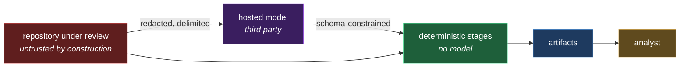
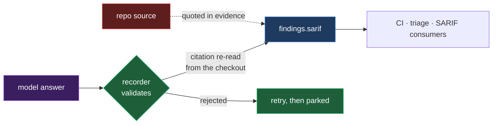
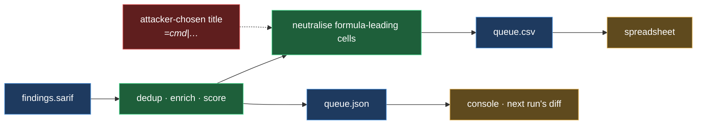
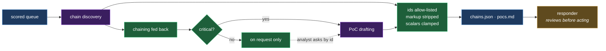
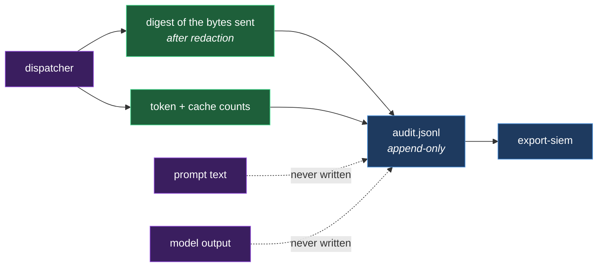
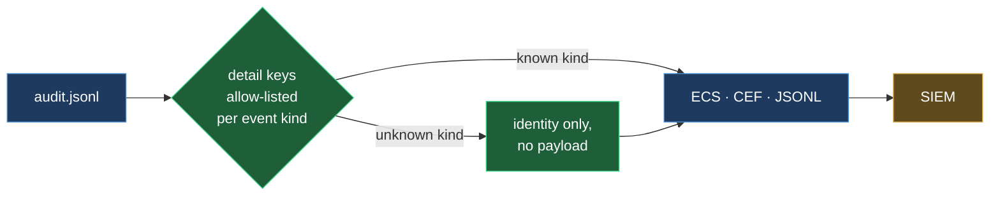
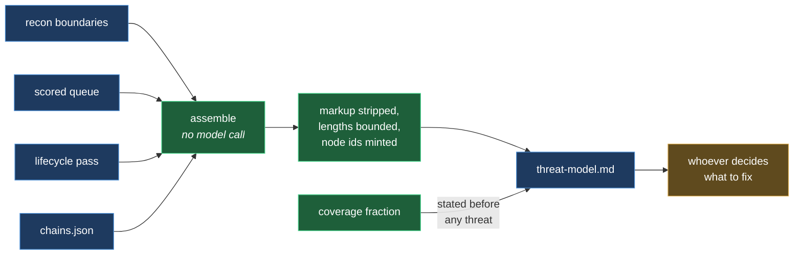
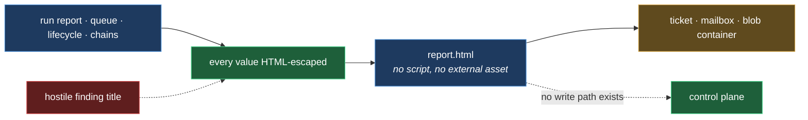
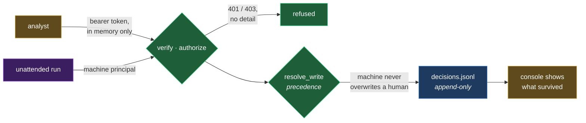
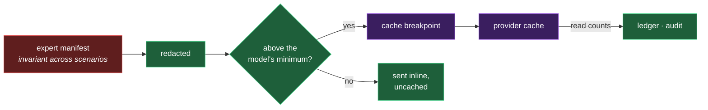

# The outputs of a repo analysis

Everything one run of `engagement run` produces: what it is, who reads it,
**what it must not be read as**, and the threat model for each.

Its own file rather than a section of the threat model, because these are two
different questions with two different readers.
[THREATMODEL.md](THREATMODEL.md) asks what could go wrong inside the pipeline,
and its reader is someone assessing this package. This file asks what a reader
of a given artifact may safely conclude from it — and its reader is whoever
picked the file up.

That distinction is the point. Most of the ways this package can mislead are
not vulnerabilities in it; they are correct files read as answers to questions
they do not answer. An empty SARIF is the canonical case: a true statement
about what was reviewed, and a false one about what exists.

## Where they land

All under `<workspace>/runs/<target>/<run-id>/`.

| File | Written by | Read by | Survives the run? |
|---|---|---|---|
| `findings.sarif` | workspace export | the queue half; CI | ● |
| `parked-scenarios.json` | driver | `--resume-parked` | ● |
| `queue.csv` | `export` | analysts, ticketing | ● |
| `queue.json` | `export` | the console; the next run's diff | ● |
| `<baseline>.json` | `export` | the **next** run's movement column | ● |
| `chains.json` | `analysis` | analysts; the report | ● |
| `pocs.md` | `analysis` | responders | ● |
| `pocs.json` | `analysis` | the console, beside the finding | ● |
| `pocs-requested.md` | `draft-poc` | the analyst who asked | ● |
| `decisions.jsonl` | the control plane | the console; the next run's queue | ● |
| `threat-model.md` | `threatmodel` | whoever decides what to fix, and in what order | ● |
| `report.html` | `report` | analysts; ticket attachments | ● |
| `audit.jsonl` | dispatcher, every call | `export-siem`; compliance | ● |
| SIEM export | `export-siem` | your SIEM | ● |
| `kev.json` | `fetch-kev` | enrichment | cached, shared across runs |

The baseline is the only artifact whose *purpose* is the next run: it carries
each finding's previous severity, previous score, and the run it was first seen
in, which is what makes `severity_delta` and `first_seen_run` mean anything.

## What every output has in common

Three rules hold across everything below.

**A model's answer is data.** Never executed, never trusted to name a file,
never allowed to extend a queue it was asked only to annotate.

**Every value in every output is attacker-influenced.** Titles, paths,
components and evidence are recovered from a repository under review. Each
output neutralises them for its own medium — escaped for HTML, prefixed for a
spreadsheet, stripped of markup for a rendered pack — because "this text is
inert" is a property of a destination, not of the text.

**Absence is reported as absence.** A stage that could not check something
never produces output shaped like a stage that checked and found nothing. Where
an artifact can be thin for a reason, it says which reason.
### `findings.sarif` — what the review concluded

Produced by the workspace from recorded scenario results; read by CI, by this
package's own triage half, and by any SARIF consumer.

| Threat | Control | Test |
|---|---|---|
| A finding cites evidence that is not in the checkout | every citation re-read from the checkout before the result is recorded | `test_e2e.py` (workspace conformance) |
| An empty SARIF reads as "nothing found" | coverage travels with the run and a parked scenario keeps it out of exit 0 | `test_parked_scenarios_never_count_as_a_clean_run` |
| One model context serves the whole backlog | unique agent id per item, enforced across passes | `test_agent_ids_stay_unique_across_passes` |

### `queue.csv` and `queue.json` — the worklist

The deterministic backbone's output. `queue.csv` is opened in a spreadsheet far
more often than it is parsed, which is itself the threat.

| Threat | Control | Test |
|---|---|---|
| A hostile title executes when the queue is opened in Excel | formula-leading cells prefixed so they are inert | `test_a_hostile_title_cannot_execute_in_a_spreadsheet` |
| A first run labels everything `new` and trains analysts to ignore movement | no baseline reports `unknown`, never `new` | `test_a_first_run_reports_unknown_movement_not_new` |
| A merge silently drops the worse reading | merge keeps the highest score and counts what it absorbed | `test_a_merge_keeps_the_worse_reading` |
| The manifest is re-read as findings and used to spend | strict model rejects unknown fields; a non-manifest is refused | `test_a_manifest_that_is_not_one_is_refused` |

### `chains.json` and `pocs.md` — the advisory pack

Model-authored prose about model-found findings: the output with the least
deterministic grounding, and the only one that is *procedural*.

| Threat | Control | Test |
|---|---|---|
| A model extends the queue by inventing a finding | ids allow-listed to the request; a chain under two admissible ids is dropped | `test_a_chain_may_only_reference_findings_from_its_own_request` |
| Model prose carries markup into a rendered view | angle brackets stripped from every model-supplied string | `test_model_prose_cannot_carry_markup_into_the_pack` |
| A draft is mistaken for something that was executed | the pack states nothing was run, in its own preamble | `test_the_pack_says_nothing_was_executed` |
| A missing draft reads as "no proof of concept exists" | undrafted findings named, with the request path in the same warning | `test_findings_below_critical_are_named_and_pointed_at_the_request_path` |
| An unattended run drafts outside the critical set on its own authority | `draft_poc` refuses a machine actor, derived from the subject | `test_a_run_may_not_authorise_its_own_exception_to_the_critical_rule` |

### `audit.jsonl` — what was sent, and what it cost

The only artifact that answers "what did this run actually do". It must
therefore never become a second copy of the thing it describes.

| Threat | Control | Test |
|---|---|---|
| The trail leaks the source or credentials it exists to account for | events carry digests and counts only, never prompt text or output | `test_no_prompt_text_or_model_output_is_recorded` |
| A digest identifies text that never left the process | the digest is taken *after* redaction, over exactly what was sent | `test_the_digest_covers_the_prefix_that_was_sent` |
| A write failure loses a call silently | a failed write is an error, not a warning | `test_a_write_failure_is_an_error_not_a_warning` |
| A corrupt line is skipped and a decision vanishes | a corrupt line raises rather than being dropped | `test_a_corrupt_audit_line_is_an_error_not_a_skip` |

### SIEM export — the trail leaving the estate

The one output that crosses into a *third* system, where the reader cannot ask
this package what a field means.

| Threat | Control | Test |
|---|---|---|
| A new event kind ships an unreviewed payload to a log platform | an unclassified kind exports its identity and none of its detail | `test_an_unclassified_event_ships_its_identity_and_none_of_its_payload` |
| Export widens what the trail discloses | export is a pure function of the trail; keys allow-listed per kind | `test_a_detail_key_outside_the_allowlist_is_dropped_and_reported` |
| An incomplete run is indistinguishable from a clean one in the SIEM | incomplete runs exported at a raised severity | `test_an_incomplete_run_is_exported_at_a_higher_severity_than_a_clean_one` |

### `threat-model.md` — the system as reviewed

A threat model **of the repository that was scanned**, one per run, written
beside the queue it is derived from. The queue answers "which finding first";
the report answers "how much was reviewed"; this answers the question asked
before either — what does this system expose, to whom, and what would go wrong.

Assembled entirely from evidence the run already gathered: entry points from
recon's request boundaries, assets from components and the lifecycle pass,
threats from the scored queue, combinations from chain discovery. **No model is
called to write it**, so it is a projection of what was found rather than a
fifth opinion about it, and the same run produces the same document.

| Threat | Control | Test |
|---|---|---|
| A model of 40% of a system is read as a model of the system | coverage is stated before any threat, and a partial run says so in the banner | `test_coverage_is_stated_before_any_threat` |
| A quiet section reads as a safe area | every section that can be thin for a reason names the reason — no recon data, no lifecycle feed, no chain discovery | `test_a_missing_input_is_named_rather_than_left_empty` |
| A finding title from the repository breaks or escapes the Markdown | markup, pipes and newlines stripped from every value; lengths bounded | `test_a_hostile_finding_title_cannot_break_the_document` |
| A path from the repository becomes Mermaid syntax and the diagram silently stops rendering | node ids are minted, never taken from the data | `test_diagram_node_ids_are_minted_not_taken_from_findings` |
| A repository with hundreds of findings produces an unreadable diagram that looks complete | the diagram is bounded and says how many it left out | `test_the_diagram_is_bounded_and_says_what_it_omitted` |
| The threat model needs a model call, and becomes a fifth thing to distrust | assembled deterministically from artifacts the run already wrote | `test_the_threat_model_is_deterministic_and_calls_no_model` |

### `report.html` — the read-only view

Attached to tickets and mailed. It renders attacker-influenced text, is opened
by people who did not run the scan, and **cannot change anything**.

| Threat | Control | Test |
|---|---|---|
| A hostile title executes in the reader's browser | every rendered value HTML-escaped; the page carries no script | `test_a_hostile_title_is_escaped_in_the_report` |
| A reader acts on a queue without knowing how much was reviewed | coverage is the first thing the page states | `test_coverage_is_the_first_thing_the_page_says` |
| An anonymous reader closes a finding | the page has no write path at all; states are set through the control plane | — *(structural: there is no code to test)* |

### `decisions.jsonl` and the console — the write path

The only place a person changes state, and therefore the only artifact whose
integrity depends on **who** rather than **what**.

| Threat | Control | Test |
|---|---|---|
| An unauthenticated party changes a validation state | OIDC verification with algorithms pinned in configuration | `test_health_is_the_only_unauthenticated_route` |
| A machine proposal overwrites a human decision | one `resolve_write` holds the rule; every store routes through it | `test_a_machine_never_overwrites_a_human_decision` |
| An analyst closes a finding without a second pair of eyes | terminal states require the approver role | `test_an_analyst_may_investigate_but_not_close` |
| The page decides authority for itself | the server computes the settable states and refuses regardless | `test_hiding_a_control_is_a_courtesy_and_the_server_still_refuses` |
| A finding title from the repo executes in the console | the page builds nodes and assigns text; nothing is written as markup | `test_the_page_never_writes_queue_data_as_markup` |
| A bulk change is refused halfway and nobody can say which half happened | authorized once before any write, reported per finding | `test_a_bulk_change_is_authorized_once_before_anything_is_written` |
| A run id from a query string reads a queue outside the workspace | the resolved path is checked against the workspace root | `test_a_run_id_cannot_escape_the_workspace` |
| A valid token calls the surface as fast as it likes | per-principal buckets, with a smaller allowance on the routes that spend | `test_a_caller_past_its_allowance_is_refused` |
| A shared development token becomes a network-reachable credential | `--dev-token` is refused unless the listener is on loopback | `test_a_shared_dev_token_is_refused_off_loopback` |
| The history of a decision is lost when it is superseded | append-only; the current state is the last line, not the only one | `test_the_decision_log_keeps_history_not_just_current_state` |

### The cached prompt prefix — an output that goes *out*

Not a file, but it leaves the process and persists on a third party's
infrastructure for the life of the cache entry, which makes it an output.

| Threat | Control | Test |
|---|---|---|
| A credential rides into a cached span and persists there | the prefix is redacted like every other byte that leaves | `test_the_prefix_is_redacted_like_everything_else_that_leaves` |
| Hoisting content changes what the model was asked | only the manifest moves; the instruction block stays with the header it refers to | `test_the_instruction_block_stays_with_the_header_it_refers_to` |
| A prefix is dropped on a surface that cannot cache it | folded into the system prompt instead, never discarded | `test_a_surface_without_cache_control_still_receives_the_prefix` |
| Every call pays a write premium for an entry nothing reads | reads are counted and a cache that never hits is a warning | `test_a_cache_offered_and_never_read_is_a_warning_not_a_zero` |

